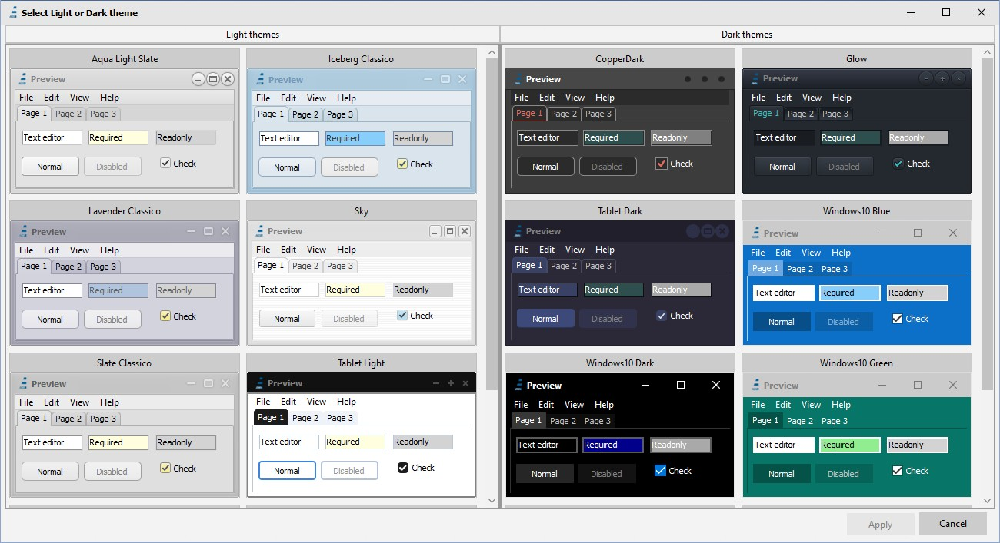

# VCLThemeSelector [](https://opensource.org/licenses/Apache-2.0)

**Easy and elegant preview/selection of Theme (Light or Dark) for VCL apps plus HighDPI demo**

Related links: https://www.embarcadero.com/ - https://learndelphi.org/

With **VCLThemeSelector** you can easily add a modern and elegant Theme selector for your Delphi VCL app. The Form shows all the VCL Styles included in your application, then arrange them in defined Rows and Columns. You can specify to include or not 'Windows' not-styled option.

### Preview (from Delphi 10.4 to Delphi 12 - using PerControlStyles)


### Preview (before Delphi 10.3 - Without PerControlStyle)


Use the **VCLThemeSelectorLauncher** demo present in Demo Folder to test it, and see how it's easy to use it, like in this example:

```pascal
var
  LStyleName: string;
  LExcludeWindows: boolean;
  LMaxRows, LMaxCols: Integer;
begin  
  LStyleName := TStyleManager.ActiveStyle.Name;
  LExcludeWindows := False;
  LMaxRows := 3;
  LMaxCols := 4;
  if ShowVCLThemeSelector(LStyleName, LExcludeWindows, LMaxRows, LMaxCols) then
    TStyleManager.SetStyle(LStyleName);
end;    
```

License: the CBVCLStylePreview is based on VCLStylePreview (Vcl.Styles.Ext) from:
[github.com/RRUZ/vcl-styles-utils](https://github.com/RRUZ/vcl-styles-utils/) with full High-DPI support, and released under Apache 2.0 license.

## High-DPI Delphi App full example ##

Also included in this repository you can find a full example of an HighDPI - VCL Themed enabled application that uses the VCLThemeSelector to change the Theme. You can run the demo from: Demo\Bin\ModernAppDemo.exe.

### Preview ( Delphi 12 and Windows 11 Modern Dark Style)


### Preview ( Delphi 12 and Windows 11 Modern Light Style)


### Demo from 10.1 to 10.3 (with SVGIconsImageList)


### Demo with Delphi 12 (with PerControlStyle and IconFontsImageList)


WARNING: to edit and compile the demo you must first download:
IconFontsImageList free components [here...](https://github.com/EtheaDev/IconFontsImageList/) and SVGIconImageList free components [here...](https://github.com/EtheaDev/SVGIconImageList/)

You can also use StyledComponents, enabling STYLEDCOMPONENTS Compiler directive in the Demo. You must first download StyledComponents [here...](https://github.com/EtheaDev/StyledComponents/)

### Preview using StyledComponents with Rounded Buttons


### License

this Demo is inspired by TSplitView demo (original software is Copyright (c) 2015 Embarcadero Technologies, Inc.) and is released under Apache 2.0 license.


## Compatibility ##

**VCLThemeSelector** and **VCLThemeSelectorLauncher** are compatible from Delphi XE5 to 12, with some differences to High-DPI support.

**ModernAppDemo** is compatible with Delphi Delphi 12, 11, 10.4, 10.3, 10.2 and 10.1 (notice: 10.1 png stream format of pictures inside biolife.xml are incompatible: use an old biolife.xml file).

## Release Notes ##

20 Nov 2024
- Added support for Delphi 12.2
- Fixed Font Loading fron Registry in DemoApp

26 Apr 2024
- Added support for Delphi 12.1
- Added StyledComponents integration
- Added StyledComponents interposer in demo

20 Oct 2023
- Added support for Delphi 12
- Examples Built with Delphi 12 (beta)

04 Mar 2023
- Built with Delphi 11.3
- More VCL Styles supported

15 Sep 2022
- Built with Delphi 11.2

10 Apr 2022
- Built with Delphi 11.1
- Fixed Size of menu when resize icons

16 Feb 2022
- Added italian translation
- SetEditorStyleAttributes to assign required/readonly attributes to edit controls
- Added pixelsperinch when storing font
- Added RegisterThemeAttributes to interface to add personal Styles

19 Oct 2021
- Replaced "Windows11 Light" and "Windows11 Dark" Styles with "Windows11 Modern Light" and "Windows11 Modern Dark"
- Updated demos to use new Windows 11 Styles available from Get-It

16 Oct 2021
- Added New Windows11 Light and Dark Themes to Modern Demo (Delphi 11)
- Added New Windows11 Light and Dark Themes to Launcher (Delphi 11)

23 Aug 2021
- Added support for Delphi 11

24 Jan 2021
- Changed preview to separate Light and Dark Themes
- Added support for info about Themes: 
  TThemeAttribute = class
    StyleName: String;
    ThemeType: TThemeType;
    EditRequiredColor: TColor;
    EditReadonlyColor: TColor;
  end;
  
30 Aug 2020
- Changed demo to use new IconsFontsVirtualImageList and SVGIconVirtualImageList components
- Updated external project VCLStyleUtils

19 Jun 2020
- Fixed VCLThemeSelector for app in "Windows" Style for D10.4
- Recompiled Demo with IconFontsImageList 2.0 (with GDI+ support)

11 Jun 2020
- Added SVGIconImageList
- Demo: swith icons from Fonts to SVG

09 Jun 2020
- Updated Demo for Delphi 10.4
- Added custom form "per-control styled" for D10.4

17 May 2020
- Changed "Material Design Desktop" Font used in Demo

27 Apr 2020
- Added VCLThemeSelectorLauncher 

25 Apr 2020
- First release of Selector and Demo App
